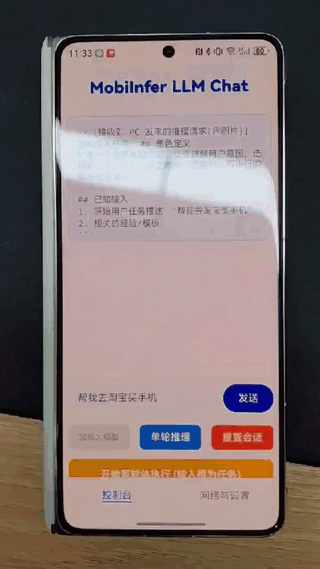

# Mobiinfer -- 端侧执行（高通 NPU / 麒麟 NPU ）多模态大模型

本文档说明如何在 mobiinfer 中准备并运行 Qwen3-VL。

- 第 1 部分：高通 NPU（支持离线交叉编译，分 chunk 主干text 网络 + fix-shape visual 网络 图片输入样例\test.jpg\<hw\>600,270\</hw\>\</img\>） 如果要改变图片输入尺寸，在下面docker_qnn编译阶段改变输入张量尺寸，现在 visual blocks 输入seqlen = 608 对应height = 600, weight = 270
- 第 2 部分：麒麟 NPU（fix-shape visual 网络）

## Demo（手机 GUI Agent 功能展示）

[](doc/demo.mp4)

点击上图可打开/播放原始视频：[doc/demo.mp4](doc/demo.mp4)

以上demo仓库可以详见[mobiinfer-oh](https://github.com/doulujiyao12/mobiinfer-oh)

## 0. 量化与校准工具（mobi-autoround）

- 项目地址：<https://github.com/doulujiyao12/mobi-autoround>
- 该仓库支持自定义图片校准数据集，并导出 GPTQ 格式量化结果；导出的 GPTQ 格式可通过本仓库的 `llmexport` 进一步转换成 MNN 推理所需的文件格式。

---

## 1. 高通 NPU（Qualcomm）

### 1.0 Qualcomm NPU 依赖获取

如果你要在宿主机或开发机上准备 Qualcomm NPU 相关环境，可以按下面步骤获取依赖：

1. 注册高通账号：<https://myaccount.qualcomm.com/signup>
2. 访问 Qualcomm AI Engine Direct SDK（QNN SDK），下载 SDK 并解压到本地目录。
  - 示例路径：`/home/xiaying/third/qnn/qairt/2.38.0.250901`
3. 修改 `~/.bashrc`，把 SDK 路径加入环境变量，然后执行 `source ~/.bashrc`，或者重新打开终端。

示例配置：

```bash
export QNN_SDK_ROOT=/home/xiaying/third/qnn/qairt/2.38.0.250901
export QNN_ROOT=/home/xiaying/third/qnn/qairt/2.38.0.250901
export HEXAGON_SDK_ROOT=/home/xiaying/third/qnn/qairt/2.38.0.250901
```

### 1.1 在 Ubuntu x86 上编译 QNN 交叉编译中间工具

> 这一步用于产出 QNN SDK 交叉编译流程需要的中间工具，**不会**产出可直接在手机侧运行的二进制文件。

```bash
cd ./mobiinfer
mkdir build_qnn_x86
cd build_qnn_x86
cmake .. \
  -DMNN_BUILD_LLM=true \
  -DMNN_LOW_MEMORY=true \
  -DMNN_BUILD_LLM_OMNI=ON \
  -DMNN_BUILD_TEST=ON \
  -DMNN_QNN=ON \
  -DMNN_QNN_CONVERT_MODE=ON \
  -DMNN_WITH_PLUGIN=OFF \
  -DMNN_BUILD_TOOLS=ON \
  -DMOBIINFER_MNN=ON \
  -DMNN_SUPPORT_TRANSFORMER_FUSE=ON

make -j64
```

### 1.2 编译 Android 侧可执行文件（llm_demo）

> 这一步用于编译可在高通手机上运行的可执行文件，例如 `llm_demo`。

```bash
cd ./project/android
mkdir build
cd build
../build_64.sh \
  -DMNN_SUPPORT_BF16=true \
  -DMNN_BUILD_LLM=true \
  -DMNN_ARM82=true \
  -DMNN_OPENCL=true \
  -DMNN_USE_LOGCAT=true \
  -DMNN_BUILD_LLM_OMNI=ON \
  -DMNN_LOW_MEMORY=true \
  -DMNN_CPU_WEIGHT_DEQUANT_GEMM=true \
  -DMNN_IMGCODECS=true \
  -DMNN_QNN=ON \
  -DMNN_WITH_PLUGIN=ON \
  -DMOBIINFER_MNN=ON \
  -DMNN_QNN_CONVERT_MODE=OFF
```

### 1.3 量化模型准备

如果采用 `mobi-autoround` 产出的 GPTQ 量化结果，请在导出时添加 `--gptq_path` 指向对应的 GPTQ 模型目录：

```bash
cd ./transformers/llm/export
python llmexport.py --path /origin/fp/model/path \
    --export mnn --gptq_path /gptq/model/path --quant_bit 4 --quant_block 128 \
    --visual_quant_bit 4 --visual_quant_block 128 --lm_quant_bit 16 \
    --seperate_embed --visual_split
```

### 1.4 构建 qnn_docker（生成 QNN 模型离线转换的 bin 权重与执行图）

> 该步骤用于构建 `qnn_docker` 环境，离线生成 QNN 模型转换所需的 `bin` 权重文件与执行图。

- 参考文档：[qnn_docker/README.md](qnn_docker/README.md)

### 1.5 推送 QNN 运行时依赖与模型并执行（Android）

首先将生成的./project/android/build 中的 llm_demo文件和so文件（包括tools/cv/libMNNOpenCV.so 和audio/libMNNAudio.so，中间编译产出不需要）推送到手机的指定目录 (PHONEDIR = /data/local/tmp/mobiinfer 可以指定任何可执行权限的目录下)：

将 QNN 相关运行时库推送到 Android 侧测试目录：

```bash
ANDROID_WORKING_DIR=/data/local/tmp/mobiinfer/qnn_sdk
HEXAGON_ARCH=75
adb push ${QNN_SDK_ROOT}/lib/aarch64-android/libQnnHtp.so ${ANDROID_WORKING_DIR}
adb push ${QNN_SDK_ROOT}/lib/aarch64-android/libQnnHtpV${HEXAGON_ARCH}Stub.so ${ANDROID_WORKING_DIR}
adb push ${QNN_SDK_ROOT}/lib/hexagon-v${HEXAGON_ARCH}/unsigned/libQnnHtpV${HEXAGON_ARCH}Skel.so ${ANDROID_WORKING_DIR}
adb push ${QNN_SDK_ROOT}/lib/aarch64-android/libQnnSystem.so ${ANDROID_WORKING_DIR}
```

推送模型：

```bash

cd transformers/llm/export
adb push model /data/local/tmp/mobiinfer/model
```

手机上运行：

```bash
export ADSP_LIBRARY_PATH=/qnn/sdk:$ADSP_LIBRARY_PATH
export LD_LIBRARY_PATH=/system/lib64:/vendor/lib64:{ANDROID_WORKING_DIR}:{PHONEDIR}:$LD_LIBRARY_PATH

cd ${PHONEDIR}
./llm_demo model/config_qnn.json
```

一个典型的 `config_qnn.json` 示例：

```json
{
  "llm_model": "qnn/llm.mnn",
  "chunk_limits": [128, 1],
  "backend_type": "cpu",
  "thread_num": 4,
  "precision": "low",
  "memory": "low",
  "sampler_type": "mixed",
  "temperature": 0.8,
  "top_k": 40,
  "top_p": 0.9,
  "min_p": 0.05,
  "tfs_z": 1.0,
  "typical": 0.95,
  "repetition_penalty": 1.0,
  "presence_penalty": 0.0,
  "frequency_penalty": 0.0,
  "penalty_window": 0,
  "n_gram": 8,
  "ngram_factor": 1.0,
  "tokenizer_file": "tokenizer.mtok",
  "mllm": {
    "backend_type": "cpu",
    "thread_num": 4,
    "precision": "normal",
    "memory": "low"
  },
  "visual_split": true,
  "visual_pre_model": "visual_pre.mnn",
  "visual_blocks_model": "visual_blocks_69_79.mnn",
  "visual_post_model": "visual_post.mnn",
  "visual_blocks_backend_type": "cpu"
}
```

其中：

- `qnn/llm.mnn` 是主干 text 网络转化后的 QNN bin 和 MNN 文件（同名 `.mnn` 对应 QNN 的权重与执行图产物）。
- `visual_blocks_69_79.mnn` 是图片 visual 网络（blocks）转化后的 QNN bin 和 MNN 文件。

### 1.6 结果说明

- `build_qnn_x86` 阶段：提供 QNN 相关中间工具（用于转换/交叉编译流程）
- `project/android/build` 阶段：产出手机侧可运行程序（含 `llm_demo`）

---

## 2. 麒麟 NPU（Kirin）

下面给出在本仓库中准备并在麒麟 NPU（HiAI/Huawei）上构建运行的建议流程与示例命令。

### 2.1 下载并准备 CANN Kit

1. 从华为开发者网站下载 CANN-Kit-next-6.0.1.0：

  https://developer.huawei.com/consumer/cn/doc/hiai-Library/ddk-download-0000001053590180

2. 解压后，将其中的 `arm64-v8a` 与 `include` 两个目录拷贝到仓库的第三方路径：

```bash
# 假设已将包解压到 ~/downloads/CANN-Kit-next-6.0.1.0
cp -r ~/downloads/CANN-Kit-next-6.0.1.0/ddk/ai_ddk_lib/lib64/* ./source/backend/hiai/3rdParty/arm64-v8a
cp -r ~/downloads/CANN-Kit-next-6.0.1.0/ddk/ai_ddk_lib/include/* ./source/backend/hiai/3rdParty/include
```

（目标位置：`source/backend/hiai/3rdParty/arm64-v8a` 和 `source/backend/hiai/3rdParty/include`）

### 2.2 下载 Huawei Command Line Tools

1. 从华为开发者官网下载 Command Line Tools（用于 HarmonyOS/鸿蒙 构建工具链）：

  https://developer.huawei.com/consumer/cn/download/command-line-tools-for-hmos?ha_source=sousuo&ha_sourceId=89000251

2. 解压或放置到合适位置，并设置环境变量 `HARMONY_HOME` 指向解压后的 OpenHarmony SDK 路径，例如：

```bash
# 假设解压后 sdk 在 commandline-tools/command-line-tools/sdk/default/openharmony/
export HARMONY_HOME=/path/to/commandline-tools/command-line-tools/sdk/default/openharmony/
```

（请根据实际解压路径替换 `/path/to/...`）

### 2.3 导出适配 Kirin NPU 的 MNN 模型

如果采用 `mobi-autoround` 产出的 GPTQ 量化结果，请在导出时添加 `--gptq_path` 指向对应的 GPTQ 模型目录：

在导出 Qwen3-VL 的 MNN 模型时，可以通过下面命令对视觉分支进行切分，降低 Kirin NPU 在线编图时的内存压力：

```bash
cd ./transformers/llm/export
python llmexport.py --path /origin_fp/model_path \
    --export mnn --gptq_path /gptq/model/path --quant_bit 4 --quant_block 128 \
    --visual_quant_bit 4 --visual_quant_block 128 --lm_quant_bit 16 \
    --seperate_embed --visual_split --visual_npu_chunk 6 \
    --visual_chunk_backends "npu,npu,npu,npu,cpu,cpu"
```

参数说明：

- `--visual_npu_chunk 6` 表示把视觉头切分成 6 份。Kirin NPU 在线编译时，如果单个 graph 过大，容易报 `Low memory` 错误，因此将视觉部分拆成 6 份来减少单次编图压力。
- `--visual_chunk_backends "npu,npu,npu,npu,cpu,cpu"` 表示这 6 份分别使用哪些后端执行。上面的配置表示前 4 份跑在 NPU，后 2 份跑在 CPU。
- 不建议 6 份全部都配置为 `npu`，否则在部分机型或大模型场景下，应用可能会直接 crash。

### 2.4 编译仓库中的 Harmony/鸿蒙 端库（生成 `libMNN.so`）

进入构建目录并运行仓内提供的构建脚本：

```bash
cd ./project/harmony
mkdir -p build
cd build
../build_64.sh
```

运行成功后，会在相应输出目录生成 `libMNN.so`（或位于 `build/output` / `build/lib` 等子目录，视 `build_64.sh` 脚本实现而定）。

### 2.5 使用鸿蒙 App 进行测试

由于鸿蒙系统不支持命令行开发，我们开发了鸿蒙 App 进行测试。编译得到的 `libMNN.so` 需要替换到 [mobiinfer-oh](https://github.com/doulujiyao12/mobiinfer-oh) 仓库中对应位置：

- https://github.com/doulujiyao12/mobiinfer-oh/blob/dev/entry/libs/arm64-v8a/libMNN.so

### 2.6 Kirin9020 完整离线编译（VIT NPU OMC W8A8 + LLM CPU INT8）

以下是从 HuggingFace 模型 + GPTQ W8G128 量化模型出发，产出 Kirin9020 完整推理模型目录的一键脚本。

> **前提**：机器上已配置 CANN Kit（DDK-tools-next-6.0.1.0）及 Conda `cann` 环境。
> **校准数据**：W8A8 量化需要 2~4 张真实图片的激活值作为校准输入（.npz 格式）。如果没有现成的校准数据，可以先执行 `llm_demo` 并设置 `MNN_VISUAL_CHUNK_INPUT_DUMP` dump 出各 chunk 的 tensor，再用 `bin_to_chunk_npz.py` 转换为 .npz 格式。

```bash
#!/usr/bin/env bash
set -euo pipefail
# ============================================================
# Kirin9020 完整离线编译脚本
# 输入: HuggingFace 模型 + GPTQ W8G128 量化模型
# 输出: 编译完成的 MNN 推理目录（VIT 4 chunk OMC + CPU INT8）
# 用法: bash kirin9020_compile.sh /path/to/hf_model /path/to/gptq_model /path/to/output
# ============================================================
HF_MODEL=${1:?missing HF model path}
GPTQ_MODEL=${2:?missing GPTQ model path}
OUTPUT_DIR=${3:?missing output dir}
cd "$(dirname "$0")/transformers/llm/export"

# ---- Step 1: 导出 MNN 模型（LLM CPU INT8 + VIT 6 chunks）----
# GPTQ W8G128 → MNN INT8, visual_chunk_backends 控制每个 chunk 的目标后端
python llmexport.py --path "$HF_MODEL" \
    --export mnn \
    --gptq_path "$GPTQ_MODEL" \
    --quant_bit 8 --quant_block 128 \
    --visual_quant_bit 8 --visual_quant_block 128 \
    --lm_quant_bit 16 \
    --seperate_embed \
    --visual_split \
    --visual_npu_chunk 6 \
    --visual_chunk_backends "npu,npu,npu,npu,cpu,cpu" \
    --dst_path "$OUTPUT_DIR"

# ---- Step 2: W8A8 calibration + ONNX export per NPU chunk (0-3) ----
# 校准输入: .npz 格式的激活数据（hidden_states_in / rotary_pos_emb / attention_mask）
# 每个 chunk 对应 ${CALIB_DIR}/chunk_${i:02d}_sample_*.npz
CALIB_DIR=${CALIB_DIR:-/tmp/calib_inputs}
NUM_SAMPLES=${NUM_SAMPLES:-2}

for i in 0 1 2 3; do
    ROUTE_DIR="${OUTPUT_DIR}/route_chunk${i}"
    python visual_plugin_quant_matmul_route.py \
        --route_dir "$ROUTE_DIR" \
        --chunk_index $i \
        --npu_chunks 6 \
        --quant_strategy Quant_aigc_ptq \
        --weight_bit 8 --weight_algo min_max \
        --act_bit 16 --input_algo min_max \
        --num_samples "$NUM_SAMPLES" \
        --group_size 128 \
        --use_qwen3_style_rotary \
        --input_dir "$CALIB_DIR" \
        --force_regen all
done

# ---- Step 3: OMC 编译 (Kirin9020, compress_conf on) ----
for i in 0 1 2 3; do
    ROUTE_DIR="${OUTPUT_DIR}/route_chunk${i}"
    PLATFORM=kirin9020 \
    TARGET_MODEL_TYPE=omc \
    USE_COMPRESS_CONF=true \
    bash run_visual_plugin_matmul_omc.sh "$ROUTE_DIR" fp16
done

# ---- Step 4: 装配最终模型目录 ----
mkdir -p "${OUTPUT_DIR}/om"
for i in 0 1 2 3; do
    cp "${OUTPUT_DIR}/route_chunk${i}/omc_output/visual_plugin_matmul_quantized.omc" \
       "${OUTPUT_DIR}/om/visual_blocks_npu_${i}.om"
done

cd "$OUTPUT_DIR"
# 更新 config.json
python3 -c "
import json
cfg = json.load(open('config.json'))
cfg.setdefault('npu_model_dir', 'om')
cfg['visual_blocks_offline_om'] = [
    'om/visual_blocks_npu_0.om',
    'om/visual_blocks_npu_1.om',
    'om/visual_blocks_npu_2.om',
    'om/visual_blocks_npu_3.om',
    '', ''
]
json.dump(cfg, open('config.json', 'w'), indent=2, ensure_ascii=False)
"
# 生成 manifest
cat > offline_om_manifest.json <<EOF
{
  "format": "offline_compiled_omc",
  "platform": "kirin9020",
  "compression": "dopt_w8a8_compress_conf",
  "offline_vit": {
    "precision": "W8A16",
    "weight_source": "dopt_fake_quant",
    "compress_conf_used": true
  }
}
EOF

echo "Done: $OUTPUT_DIR"
```

#### 校准数据格式

Step 2 的 `--input_dir` 下每个 `.npz` 文件包含三个 float16 tensor，命名规则 `chunk_{CI:02d}_sample_{SI:03d}.npz`：

| 键 | 形状 | 说明 |
|---|---|---|
| `hidden_states_in` | `(1, 608, 1024)` | chunk 输入 |
| `rotary_pos_emb` | `(2, 608, 1, 64)` | 位置编码 |
| `attention_mask` | `(1, 608, 608)` | 因果 mask（-65504 为屏蔽） |

**生成校准数据**（方式一，推荐）：

```bash
# 先在 MNN 模型上运行图片推理，dump chunk 输入，再转成 .npz
# 输入: 训练图片（通过 llm_demo input.txt 传入）
# 输出: $CALIB_DIR/ 下的 chunk_XX_sample_YYY.npz（供 Step 2 使用）

MNN_MODEL_DIR=/path/to/mnn_model          # llmexport 产出的模型目录（含 config.json）
IMAGE_LIST=/path/to/input_image_list.txt   # llm_demo 输入文件，每行一张图片路径
CALIB_DIR=/tmp/calib_inputs                # 输出目录（供 Step 2 的 $CALIB_DIR 使用）
DUMP_DIR=/tmp/chunk_dump                   # dump 中间文件（用完可删）

# 1) dump chunk 输入 tensor
export MNN_VISUAL_CHUNK_INPUT_DUMP="$DUMP_DIR"
./llm_demo "$MNN_MODEL_DIR/config.json" "$IMAGE_LIST"

# 2) 转成 .npz 格式
python bin_to_chunk_npz.py "$DUMP_DIR" "$CALIB_DIR"
```

方式二：自行编写 Python 脚本加载 HF 模型，用 `visual.patch_embed` 逐 chunk 前向获取 hidden_states_in，按上述格式保存为 `.npz`。

#### 产物校验

编译完成后检查 `om/visual_blocks_npu_0.om` 约 98MB，日志确认含 `partition type NPU:1, CPU:0`、`SaveCompiledModelToFile SUCCESS`、`OMG generate offline model success`。

### 2.7 说明与注意事项

- 请确保 `source/backend/hiai/3rdParty/arm64-v8a` 和 `.../include` 已存在且内容完整。缺少头文件或库会导致编译失败。
- `HARMONY_HOME` 必须指向命令行工具提供的 OpenHarmony SDK 根目录，否则构建脚本找不到工具链。
- 若构建失败，请查阅 `project/harmony/build_64.sh` 中的日志与输出路径，按错误提示补充依赖。
- 本节假定你已经在机器上安装并配置好对应的交叉编译工具链以及必要的 Android/Harmony 环境变量。
- Kirin9020 OMC 不需要 AscendC 环境，编译脚本会自动跳过。如需在 Kirin9030 上使用 OMC，须先执行 `source set_ascendc_env.sh`。
- 4 个 NPU chunk（0-3）使用离线 OMC 图 + W8A8 压缩权重，约 98MB/chunk。2 个 CPU chunk（4-5）使用 MNN 格式 + 4bit 量化。

---

---

## 致谢

- 感谢 [alibaba/MNN](https://github.com/alibaba/MNN) 开源仓库提供的基础能力与工程实现。
