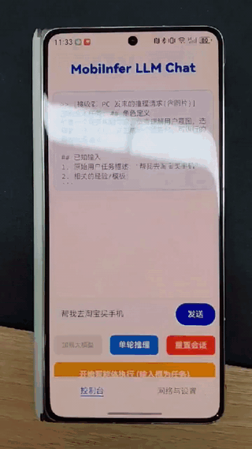

# Mobiinfer -- 端侧执行（高通 NPU / 麒麟 NPU ）多模态大模型

本文档说明如何在 mobiinfer 中准备并运行 Qwen3-VL。

- 第 1 部分：高通 NPU（支持离线交叉编译，分 chunk 主干text 网络 + fix-shape visual 网络 图片输入样例\test.jpg\<hw\>600,270\</hw\>\</img\>） 如果要改变图片输入尺寸，在下面docker_qnn编译阶段改变输入张量尺寸，现在 visual blocks 输入seqlen = 608 对应height = 600, weight = 270
- 第 2 部分：麒麟 NPU（fix-shape visual 网络）

## Demo（手机 GUI Agent 功能展示）

[](doc/demo.mp4)

点击上图可打开/播放原始视频：[doc/demo.mp4](doc/demo.mp4)

以上demo仓库可以详见[mobiinfer-oh](https://github.com/doulujiyao12/mobiinfer-oh)

## 0. 量化与校准工具（mobi-autoround）

- 项目地址：<https://github.com/doulujiyao12/mobi-autoround>
- 该仓库支持自定义图片校准数据集，并导出 GPTQ 格式量化结果；导出的 GPTQ 格式可通过本仓库的 `llmexport` 进一步转换成 MNN 推理所需的文件格式。

---

## 1. 高通 NPU（Qualcomm）

### 1.0 Qualcomm NPU 依赖获取

如果你要在宿主机或开发机上准备 Qualcomm NPU 相关环境，可以按下面步骤获取依赖：

1. 注册高通账号：<https://myaccount.qualcomm.com/signup>
2. 访问 Qualcomm AI Engine Direct SDK（QNN SDK），下载 SDK 并解压到本地目录。
  - 示例路径：`/home/xiaying/third/qnn/qairt/2.38.0.250901`
3. 修改 `~/.bashrc`，把 SDK 路径加入环境变量，然后执行 `source ~/.bashrc`，或者重新打开终端。

示例配置：

```bash
export QNN_SDK_ROOT=/home/xiaying/third/qnn/qairt/2.38.0.250901
export QNN_ROOT=/home/xiaying/third/qnn/qairt/2.38.0.250901
export HEXAGON_SDK_ROOT=/home/xiaying/third/qnn/qairt/2.38.0.250901
```

### 1.1 在 Ubuntu x86 上编译 QNN 交叉编译中间工具

> 这一步用于产出 QNN SDK 交叉编译流程需要的中间工具，**不会**产出可直接在手机侧运行的二进制文件。

```bash
cd ./mobiinfer
mkdir build_qnn_x86
cd build_qnn_x86
cmake .. \
  -DMNN_BUILD_LLM=true \
  -DMNN_LOW_MEMORY=true \
  -DMNN_BUILD_LLM_OMNI=ON \
  -DMNN_BUILD_TEST=ON \
  -DMNN_QNN=ON \
  -DMNN_QNN_CONVERT_MODE=ON \
  -DMNN_WITH_PLUGIN=OFF \
  -DMNN_BUILD_TOOLS=ON \
  -DMOBIINFER_MNN=ON \
  -DMNN_SUPPORT_TRANSFORMER_FUSE=ON

make -j64
```

### 1.2 编译 Android 侧可执行文件（llm_demo）

> 这一步用于编译可在高通手机上运行的可执行文件，例如 `llm_demo`。

```bash
cd ./project/android
mkdir build
cd build
../build_64.sh \
  -DMNN_SUPPORT_BF16=true \
  -DMNN_BUILD_LLM=true \
  -DMNN_ARM82=true \
  -DMNN_OPENCL=true \
  -DMNN_USE_LOGCAT=true \
  -DMNN_BUILD_LLM_OMNI=ON \
  -DMNN_LOW_MEMORY=true \
  -DMNN_CPU_WEIGHT_DEQUANT_GEMM=true \
  -DMNN_IMGCODECS=true \
  -DMNN_QNN=ON \
  -DMNN_WITH_PLUGIN=ON \
  -DMOBIINFER_MNN=ON \
  -DMNN_QNN_CONVERT_MODE=OFF
```

### 1.3 量化模型准备

如果采用 `mobi-autoround` 产出的 GPTQ 量化结果，请在导出时添加 `--gptq_path` 指向对应的 GPTQ 模型目录：

```bash
cd ./transformers/llm/export
python llmexport.py --path /origin/fp/model/path \
    --export mnn --gptq_path /gptq/model/path --quant_bit 4 --quant_block 128 \
    --visual_quant_bit 4 --visual_quant_block 128 --lm_quant_bit 16 \
    --seperate_embed --visual_split
```

### 1.4 构建 qnn_docker（生成 QNN 模型离线转换的 bin 权重与执行图）

> 该步骤用于构建 `qnn_docker` 环境，离线生成 QNN 模型转换所需的 `bin` 权重文件与执行图。

- 参考文档：[qnn_docker/README.md](qnn_docker/README.md)

### 1.5 推送 QNN 运行时依赖与模型并执行（Android）

首先将生成的./project/android/build 中的 llm_demo文件和so文件（包括tools/cv/libMNNOpenCV.so 和audio/libMNNAudio.so，中间编译产出不需要）推送到手机的指定目录 (PHONEDIR = /data/local/tmp/mobiinfer 可以指定任何可执行权限的目录下)：

将 QNN 相关运行时库推送到 Android 侧测试目录：

```bash
ANDROID_WORKING_DIR=/data/local/tmp/mobiinfer/qnn_sdk
HEXAGON_ARCH=75
adb push ${QNN_SDK_ROOT}/lib/aarch64-android/libQnnHtp.so ${ANDROID_WORKING_DIR}
adb push ${QNN_SDK_ROOT}/lib/aarch64-android/libQnnHtpV${HEXAGON_ARCH}Stub.so ${ANDROID_WORKING_DIR}
adb push ${QNN_SDK_ROOT}/lib/hexagon-v${HEXAGON_ARCH}/unsigned/libQnnHtpV${HEXAGON_ARCH}Skel.so ${ANDROID_WORKING_DIR}
adb push ${QNN_SDK_ROOT}/lib/aarch64-android/libQnnSystem.so ${ANDROID_WORKING_DIR}
```

推送模型：

```bash

cd transformers/llm/export
adb push model /data/local/tmp/mobiinfer/model
```

手机上运行：

```bash
export ADSP_LIBRARY_PATH=/qnn/sdk:$ADSP_LIBRARY_PATH
export LD_LIBRARY_PATH=/system/lib64:/vendor/lib64:{ANDROID_WORKING_DIR}:{PHONEDIR}:$LD_LIBRARY_PATH

cd ${PHONEDIR}
./llm_demo model/config_qnn.json
```

一个典型的 `config_qnn.json` 示例：

```json
{
  "llm_model": "qnn/llm.mnn",
  "chunk_limits": [128, 1],
  "backend_type": "cpu",
  "thread_num": 4,
  "precision": "low",
  "memory": "low",
  "sampler_type": "mixed",
  "temperature": 0.8,
  "top_k": 40,
  "top_p": 0.9,
  "min_p": 0.05,
  "tfs_z": 1.0,
  "typical": 0.95,
  "repetition_penalty": 1.0,
  "presence_penalty": 0.0,
  "frequency_penalty": 0.0,
  "penalty_window": 0,
  "n_gram": 8,
  "ngram_factor": 1.0,
  "tokenizer_file": "tokenizer.mtok",
  "mllm": {
    "backend_type": "cpu",
    "thread_num": 4,
    "precision": "normal",
    "memory": "low"
  },
  "visual_split": true,
  "visual_pre_model": "visual_pre.mnn",
  "visual_blocks_model": "visual_blocks_69_79.mnn",
  "visual_post_model": "visual_post.mnn",
  "visual_blocks_backend_type": "cpu"
}
```

其中：

- `qnn/llm.mnn` 是主干 text 网络转化后的 QNN bin 和 MNN 文件（同名 `.mnn` 对应 QNN 的权重与执行图产物）。
- `visual_blocks_69_79.mnn` 是图片 visual 网络（blocks）转化后的 QNN bin 和 MNN 文件。

### 1.6 结果说明

- `build_qnn_x86` 阶段：提供 QNN 相关中间工具（用于转换/交叉编译流程）
- `project/android/build` 阶段：产出手机侧可运行程序（含 `llm_demo`）

---

## 2. 麒麟 NPU（Kirin）

下面给出在本仓库中准备并在麒麟 NPU（HiAI/Huawei）上构建运行的建议流程与示例命令。

### 2.1 下载并准备 CANN Kit

1. 从华为开发者网站下载 CANN-Kit-next-6.0.1.0：

  https://developer.huawei.com/consumer/cn/doc/hiai-Library/ddk-download-0000001053590180

2. 解压后，将其中的 `arm64-v8a` 与 `include` 两个目录拷贝到仓库的第三方路径：

```bash
# 假设已将包解压到 ~/downloads/CANN-Kit-next-6.0.1.0
mkdir -p ./source/backend/hiai/3rdParty/{arm64-v8a,include}
cp -r ~/downloads/CANN-Kit-next-6.0.1.0/ddk/ai_ddk_lib/lib64/* ./source/backend/hiai/3rdParty/arm64-v8a
cp -r ~/downloads/CANN-Kit-next-6.0.1.0/ddk/ai_ddk_lib/include/* ./source/backend/hiai/3rdParty/include
```

（目标位置：`source/backend/hiai/3rdParty/arm64-v8a` 和 `source/backend/hiai/3rdParty/include`）

这是手机端运行库；第 2.6 节的离线编译还需要主机侧 **DDK-tools**（已验证版本 `DDK-tools-next-6.1.1.0`），两者是不同的 SDK 包。

### 2.2 下载 Huawei Command Line Tools

1. 从华为开发者官网下载 Command Line Tools（用于 HarmonyOS/鸿蒙 构建工具链）：

  https://developer.huawei.com/consumer/cn/download/command-line-tools-for-hmos?ha_source=sousuo&ha_sourceId=89000251

2. 解压或放置到合适位置，并设置环境变量 `HARMONY_HOME` 指向解压后的 OpenHarmony SDK 路径，例如：

```bash
# 假设解压后 sdk 在 commandline-tools/command-line-tools/sdk/default/openharmony/
export HARMONY_HOME=/path/to/commandline-tools/command-line-tools/sdk/default/openharmony/
```

（请根据实际解压路径替换 `/path/to/...`）

### 2.3 导出适配 Kirin NPU 的 MNN 模型

如果采用 `mobi-autoround` 产出的 GPTQ 量化结果，请在导出时添加 `--gptq_path` 指向对应的 GPTQ 模型目录：

在导出 Qwen3-VL 的 MNN 模型时，可以通过下面命令对视觉分支进行切分，降低 Kirin NPU 在线编图时的内存压力：

```bash
cd ./transformers/llm/export
python llmexport.py --path /origin_fp/model_path \
    --export mnn --gptq_path /gptq/model/path --quant_bit 4 --quant_block 128 \
    --visual_quant_bit 4 --visual_quant_block 128 --lm_quant_bit 16 \
    --seperate_embed --visual_split --visual_npu_chunks 6 \
    --visual_chunk_backends "npu,npu,npu,npu,cpu,cpu"
```

参数说明：

- `--visual_npu_chunks 6` 表示把视觉头切分成 6 份。Kirin NPU 在线编译时，如果单个 graph 过大，容易报 `Low memory` 错误，因此将视觉部分拆成 6 份来减少单次编图压力。
- `--visual_chunk_backends "npu,npu,npu,npu,cpu,cpu"` 表示这 6 份分别使用哪些后端执行。上面的配置表示前 4 份跑在 NPU，后 2 份跑在 CPU。
- 在线编图时，6 份全部配置为 `npu` 在部分机型或大模型场景下可能触发内存不足；Kirin9030 的六段离线图流程见第 2.6 节。

### 2.4 编译仓库中的 Harmony/鸿蒙 端库（生成 `libMNN.so`）

进入构建目录并运行仓内提供的构建脚本：

```bash
cd ./project/harmony
mkdir -p build
cd build
../build_64.sh
```

运行成功后，会在相应输出目录生成 `libMNN.so`（或位于 `build/output` / `build/lib` 等子目录，视 `build_64.sh` 脚本实现而定）。

### 2.5 使用鸿蒙 App 进行测试

本项目使用鸿蒙 App 进行图文推理测试。编译得到的 `libMNN.so` 需要替换到 [mobiinfer-oh](https://github.com/doulujiyao12/mobiinfer-oh) 仓库中对应位置：

- https://github.com/doulujiyao12/mobiinfer-oh/blob/dev/entry/libs/arm64-v8a/libMNN.so

### 2.6 Kirin9030 完整离线编译（ViT W4A16 + LLM CPU）

统一入口为 [`build_kirin_offline.py`](transformers/llm/export/plugin_quant_visual_matmul_route_v1/build_kirin_offline.py)，覆盖以下流程：

```text
原始 HuggingFace 模型 → MNN 运行模型 → 真实图片的各 chunk 校准输入
                     → DOPT 量化校准 → 配套 UINT4/LUT ONNX + quant_params_file
                     → OMG --target=omc → 完整 App 模型目录
```

默认将 ViT blocks 切成六段，全部编译为 Kirin9030 NPU 离线图，采用 `Quant_act_weight_eco`、W4/group64、signed INT16 激活及逐通道 INT16 输出。注意力等未量化算子仍走浮点计算；视觉前后处理和 LLM 使用 MNN。LLM 默认 CPU INT8/group128，LM head 默认 16 bit，均可配置。

此前同配置发布包已获用户真机反馈，能够区分不同图片，暂按图文功能可用记录；这不代表所有模型和校准数据都能数值对齐。原 W8A8 图文无关问题仍未修复，详见[视觉 NPU 记录 §13](docs/inference/visual-npu-notes.md#13-vit-w4a16group64-真机初测可用2026-10-08)。

#### 环境与输入

- Linux 主机已安装 CMake、C++ 编译器，以及本仓库导出依赖（见 [`requirements.txt`](transformers/llm/export/requirements.txt)）。使用包含 PyTorch、ONNX、Transformers 和 DOPT 所需依赖的 Python 3.10 环境。
- DDK-tools 包含 DOPT、OMG、`tools/platform/kirin9030` 插件，AscendC 已按 SDK 说明安装。脚本默认通过现有 OMG 包装器自动加载 AscendC 环境；无需在 zsh 中直接 `source`。
- 原始本地 HF 模型目录，以及有代表性的真实校准图片。默认每段使用 **192** 份输入；图片数量不足时应调整 `--num-samples`，2 份只适合跑通流程，不足以验证量化精度。
- 不要求先准备 GPTQ 模型。若已有 LLM GPTQ 权重，可用 `--gptq-model` 导入 MNN；ViT 的 DOPT 源模型仍来自 `--model` 指定的原始 HF 模型。

模型、平台、SDK、图片尺寸、chunk 数与后端分配、位宽、group size、量化策略和工具路径均可配置。脚本默认适用于本仓库已支持的 Qwen3-VL/mobi 视觉导出；其他模型或平台仍需相应导出支持及 SDK 支持的算子/位宽组合。

#### 从原始模型执行完整流程

在仓库根目录运行，先激活上述 Python 环境：

```bash
python -B transformers/llm/export/plugin_quant_visual_matmul_route_v1/build_kirin_offline.py \
  --model /path/to/original_hf_model \
  --ddk /path/to/DDK-tools-next-6.1.1.0 \
  --image-dir /path/to/calibration_images \
  --output /path/to/mnn_model_kirin9030_w4a16 \
  --platform kirin9030 --npu-chunks 6 \
  --weight-bit 4 --act-bit 16 --group-size 64 \
  --num-samples 192 --hw 600,270 \
  --steps all
```

`--hw` 按 **H,W** 指定图片预处理尺寸，决定静态图的输入形状；真机使用的图片预处理必须与之匹配。脚本从实际校准输入读取形状并校验各段一致，不将序列长度写死；也可用 `--sequence-length` 额外检查期望值。

工作目录默认为输出目录旁的 `<output>.work/`，包含主机工具、MNN 中间模型、校准输入、各段 ONNX/参数和日志。可用 `--work-dir` 指定其他目录。最终输出仅包含运行所需文件及 manifest/校验清单，App 不必下载这些中间文件。

#### JSON 配置与分阶段执行

可以将配置保存为本地 `build.json`。键名使用下划线，命令行参数会覆盖 JSON 中的值：

```json
{
  "model": "/path/to/original_hf_model",
  "ddk": "/path/to/DDK-tools-next-6.1.1.0",
  "image_dir": "/path/to/calibration_images",
  "output": "/path/to/mnn_model_kirin9030_w4a16",
  "platform": "kirin9030",
  "npu_chunks": 6,
  "chunk_backends": "npu,npu,npu,npu,npu,npu",
  "num_samples": 192,
  "hw": "600,270",
  "weight_bit": 4,
  "act_bit": 16,
  "group_size": 64,
  "native_weight_encoding": true,
  "output_quant": true
}
```

```bash
# 先预览完整命令，不读取权重、不生成文件
python -B transformers/llm/export/plugin_quant_visual_matmul_route_v1/build_kirin_offline.py \
  --config build.json --dry-run

# 原始模型 → MNN → 真实图片校准输入
python -B transformers/llm/export/plugin_quant_visual_matmul_route_v1/build_kirin_offline.py \
  --config build.json --steps tools,export-mnn,calib-inputs

# 校准 → 配套 ONNX → OMC → 完整运行目录
python -B transformers/llm/export/plugin_quant_visual_matmul_route_v1/build_kirin_offline.py \
  --config build.json --steps quantize,export-onnx,compile,package

# 仅重新编译指定的两个已导出 chunk
python -B transformers/llm/export/plugin_quant_visual_matmul_route_v1/build_kirin_offline.py \
  --config build.json --steps compile --chunks 0,2
```

| 阶段 | 执行内容 |
|---|---|
| `tools` | 编译主机 `MNNConvert` 和启用校准 dump 的 `llm_demo` |
| `export-mnn` | 从原始 HF 导出 LLM、视觉前后处理和全部 MNN chunks |
| `calib-inputs` | 从真实图片生成每段校准 NPZ 输入，或检查提供的已有输入 |
| `quantize` | 为所选 NPU chunks 生成配置、校准并序列化配套量化权重/参数 |
| `export-onnx` | 用 SDK 配套权重导出并校验 ONNX |
| `compile` | 按指定平台调用 OMG，检查纯 NPU 分区及离线编译成功证据 |
| `package` | 组装全部运行文件与 NPU 图，生成配置、manifest 和 SHA-256 清单 |

单独执行后续阶段需要前序产物；`package` 始终要求全部配置为 NPU 的图均已编译。阶段按 `--steps` 给出的顺序执行。同一工作目录会记录构建参数，分阶段运行应复用同一配置；更换模型、平台、输入尺寸或量化设置时使用新的工作及输出目录，避免混用旧产物。

可通过 `--mnnconvert`、`--llm-demo` 复用已有主机工具，通过 `--omg`、`--ascendc-env` 指定工具位置，参数全集见 `--help`。若使用 Path A，已有 `llm_demo` 必须编译时启用 `-DMNN_VISUAL_CHUNK_INPUT_DUMP=ON`。

OMG 对输出路径字符有限制。脚本默认在系统临时目录中暂存配套输入并编译，再拷贝到指定工作目录；可用 `--compiler-work-dir` 指定临时根目录，该路径仅使用 ASCII 字母、数字、斜杠和下划线。

#### 校准路径与权重配对

默认采用 **Path A**：先导出 MNN，将校准配置的全部视觉 chunks 切到 CPU，按图片列表运行 `llm_demo`，使用 `visual_chunk_input_dump_dir` / `visual_chunk_input_dump_samples` 配置导出输入，再调用 `bin_to_chunk_npz.py` 转换。脚本自动完成这些步骤，单独设置名为 `MNN_VISUAL_CHUNK_INPUT_DUMP` 的环境变量不会开启运行时 dump。

可用 `--calibration-method hf` 改为原始 HF 视觉前向生成输入，这与 Path A 的 MNN 数值路径不同。若已有 NPZ，可在初始配置中设置 `calib_input_dir`（或 `--calib-input-dir`），复用输入并跳过图片推理；这种情况下不需要 `image_dir`。

NPZ 命名为 `chunk_{CI:02d}_sample_{SI:03d}.npz`，包含以下浮点输入。形状以实际模型和图片尺寸为准：

| 键 | 通用形状 | 说明 |
|---|---|---|
| `hidden_states_in` | `(1, S, hidden_size)` | chunk 输入 |
| `rotary_pos_emb` | `(2, S, 1, rotary_dim)` | 位置编码 |
| `attention_mask` | `(1, S, S)` | 视觉注意力 mask；单图有效区域通常全零，并非语言模型因果 mask |

W4 原生编码必须将 `quant_param_2=True` 生成的 **UINT4/LUT 索引权重**与参数文件一起使用；这种 `fake_quant_weight.pth` 不能直接当作反量化后的浮点权重评估。统一入口默认启用该编码，保留 FLOAT32 ONNX 索引 initializer，不使用单段导出器的 `--fp16`。OMG 的 `fp16` 权重选项不意味着量化 Linear 变为 W16：其 W4 编码由配套 `compress_conf` 指定。

本流程包含 DOPT 配置、真实输入校准、权重/激活参数导出和离线编译，**不执行完整 CUDA GPTQ/QAT 三段式权重训练优化**。改变位宽或关闭原生编码只是配置能力，不代表未验证组合可以在 Kirin9030 正常编译或保持精度。

#### 产物与校验

运行目录包含 `config.json`、`llm_config.json`、tokenizer、embedding、LLM/视觉 MNN 文件，以及 `om/visual_blocks_npu_<i>.om`。这些 `.om` 文件实际来自 OMG 的 **`--target=omc`**，扩展名沿用 App 约定。脚本从图输出推导 `visual_blocks_om_deepstack_dup` 并写入配置，不将某个 chunk 编号写死。

构建时会检查 LUT/scale 解码权重与校准参考逐值一致、ONNX initializer 与 SDK 索引配套，并核对参数、ONNX 主文件和外部权重的 SHA-256。OMG 日志必须包含纯 NPU 分区、`SaveCompiledModelToFile SUCCESS` 与 `OMG generate offline model success`；最终 `success` 不能掩盖 CPU 回退或致命量化错误。

各阶段日志位于 `<work-dir>/logs/`。最终 `offline_om_manifest.json` 记录配置及图哈希，`SHA256SUMS` 可用于检查传输是否完整：

```bash
cd /path/to/mnn_model_kirin9030_w4a16
sha256sum -c SHA256SUMS
```

生成的包仍需真机图文测试；manifest 中 `device_tested` 默认是 `false`。对于已支持离线图模式的当前 App，无需改代码，将完整模型目录导入或发布后重新下载，并选择离线 NPU 模式加载即可。

统一入口已用原始 mobi 2B 模型、两张真实图片和 DDK-tools-next-6.1.1.0 跑通完整流程，六段均生成纯 NPU OMC，运行包哈希校验通过。这是流程验证，不是两张图片校准后的精度结论。

### 2.7 说明与注意事项

- 请确保 `source/backend/hiai/3rdParty/arm64-v8a` 和 `.../include` 已存在且内容完整。缺少头文件或库会导致编译失败。
- `HARMONY_HOME` 必须指向命令行工具提供的 OpenHarmony SDK 根目录，否则构建脚本找不到工具链。
- 若构建失败，请查阅 `project/harmony/build_64.sh` 中的日志与输出路径，按错误提示补充依赖。
- 本节假定你已经在机器上安装并配置好对应的交叉编译工具链以及必要的 Android/Harmony 环境变量。
- Kirin9030 离线编译需要可用的 AscendC 环境及匹配平台插件。统一入口自动加载环境，并拒绝 CPU 回退产物。
- 默认六个 ViT chunks 使用 W4A16 离线 OMC；可通过 `--chunk-backends` 指定部分 CPU chunks，其 MNN 权重精度由 `--visual-mnn-quant-bit` 控制。模型大小依赖模型结构及量化配置，不应仅按文件体积判断正确性。

---

---

## 致谢

- 感谢 [alibaba/MNN](https://github.com/alibaba/MNN) 开源仓库提供的基础能力与工程实现。
